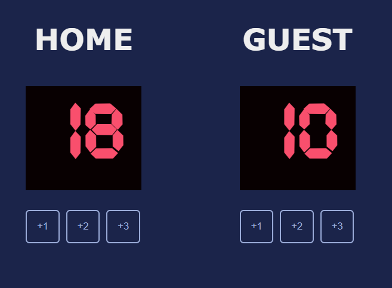

# 🏀Basketball-scorecard
The app is a simple game scorecard that allows users to add points for two teams using three buttons, each linked to a dedicated scoring function.

## 🛠️Tech Stack
  

## ⚙️How it works?
1. Clone the Repo
2. Open index.html in browser and start keeping score

## 🖻SS

## 🔛Link live

Check the live app here: 
GhPages - https://isabelamihai.github.io/Basketball-scorecard/ 
Netlify - https://scorecard-mini-app.netlify.app/
