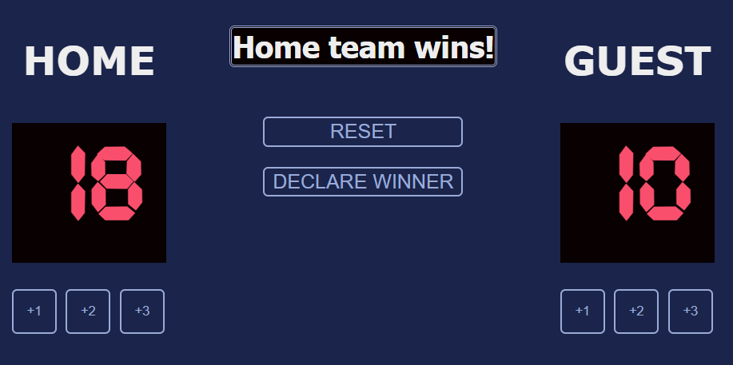

# Basketball-scorecard
The app is a game scorecard that adds points for 2 teams using 3 buttons linked to 3 functions.

## Tehnologii folosite

- HTML
- CSS
- JavaScript

## Cum se folosește

1. Clone the Repo
2. Open index.html in browser and start keeping score

## Capturi de ecran

## Link live

Vezi aplicatia live aici:
GhPages - https://isabelamihai.github.io/Basketball-scorecard/
